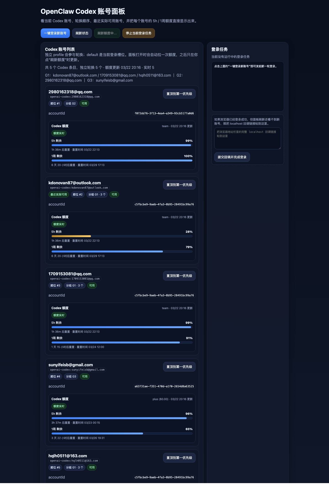

# OpenClaw Codex Account Panel

一个给 OpenClaw / Codex OAuth 多账号轮换场景用的本地面板与桌面 App。

它提供三块核心能力：

- 查看当前 Codex 账号列表、轮换顺序、lastGood
- 查看每个账号的 Codex 额度（5h / 1周）
- 查看按天聚合的实际调用记录：命中账号、调用次数、总时长、最近调用明细

## 面板预览



## 目录结构

- `panel/server.mjs`：本地 HTTP 面板服务
- `desktop/`：Tauri 桌面壳
- `scripts/openclaw_codex_add_profile.mjs`：新增 Codex OAuth 账号的辅助脚本

## 目标用户

这个项目当前的目标用户是：**已经在本机安装并使用 OpenClaw 的用户**。

它不是“完全零配置”的独立新手版；更准确地说，它是 OpenClaw / Codex 多账号场景的本地可视化面板。

## 运行前提

- macOS（当前 Release 提供 Apple Silicon 包）
- 已安装并登录 OpenClaw
- 已存在 `~/.openclaw/agents/main/agent/auth-profiles.json`
- 已在 OpenClaw 中登录过至少 1 个 Codex 账号
- Node.js 20+
- Rust / Cargo（如果要构建桌面 App）

默认工作区路径：

- `OPENCLAW_WORKSPACE` 已设置时：使用该路径
- 否则默认：`~/.openclaw/workspace`

## 启动本地面板服务

```bash
node panel/server.mjs
```

默认地址：`http://127.0.0.1:7071`

可选环境变量：

```bash
export OPENCLAW_WORKSPACE="$HOME/.openclaw/workspace"
export CODEX_PANEL_PORT=7071
export CODEX_PANEL_USAGE_TIMEOUT_MS=15000
```

## 启动桌面 App

```bash
cd desktop
npm install
npm run tauri:dev
```

## 新增 Codex OAuth 账号

```bash
node scripts/openclaw_codex_add_profile.mjs
```

脚本会：

1. 调起 `openclaw models auth login --provider openai-codex`
2. 用独立浏览器配置目录完成 OAuth 登录
3. 把新账号固化为独立 profile
4. 自动插到轮换顺序最前面

## 隐私说明

本仓库**不包含**任何个人账号数据、auth token、调用历史、缓存、日志或本机运行状态。
这些数据均保存在本机 `~/.openclaw/` 目录，不应提交到仓库。

## License

MIT

## 下载

- 如果你已经是 OpenClaw 用户，优先下载 Releases 里的 `.dmg` 安装包。
- 第一次启动前，请先确认本机 `openclaw`、`node` 和 Codex 登录数据都已就绪。
- 如果系统拦截未签名应用，请在“系统设置 → 隐私与安全性”里允许打开，或右键应用选择“打开”。

